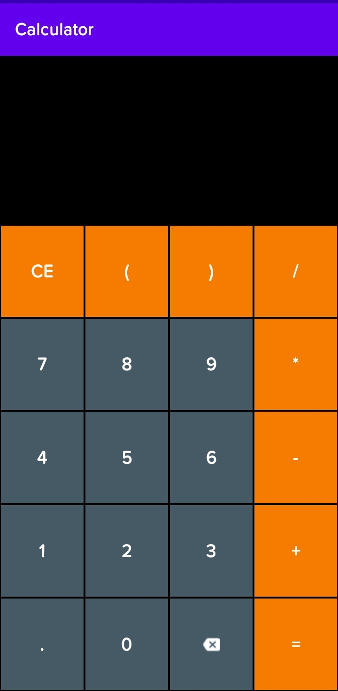
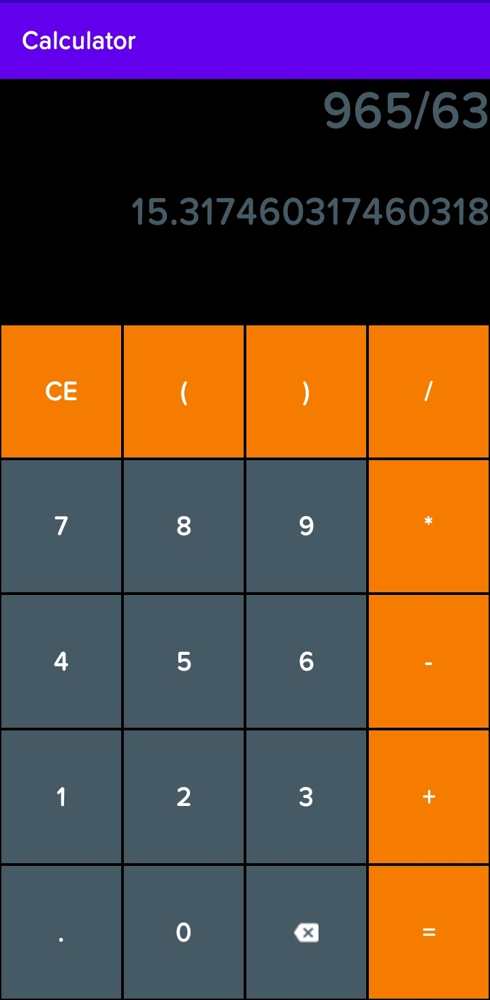

# Android-Calculator
This Repository contains the source code of a simple and easy to use android calculator application made in android studio using Kotlin Programming Language. o

Here's a snapshot of the application:

And of course the calculations :)

